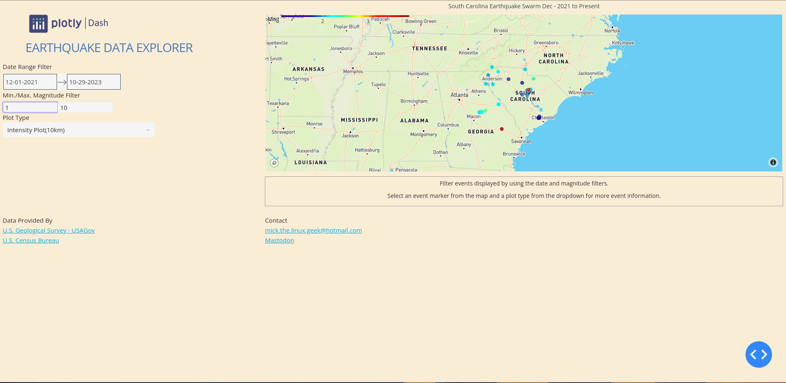
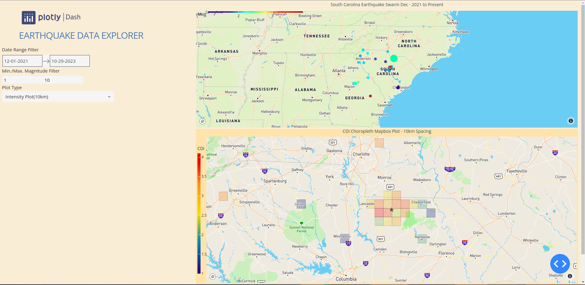
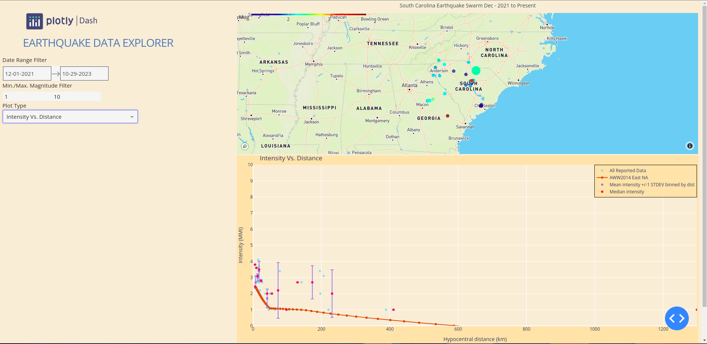

# Earthquake Data Explorer

A data visualization app for 2021 through 2022 South Carolina Earthquake Swarm.  The application will present a map 
where each event is plotted.  You can hover the mouse pointer over a marker to display some information about the 
earthquake event at that location.  By default, when the app is launched, it displays the events starting on December 
2021 until the current date.  You can filter the events displayed by using the date filter and/or the earthquake 
magnitude filter.  To display even more information about a particular event, click on the event's marker to select it, 
then choose a graph plot type from the dropdown.  The graph plot will be displayed below the events map.

This application was developed with Python, Dash library for creating low-code web data applications, and the Plotly 
library for creating the map and table visualizations.

# Installation

### Render.com

There is an instance of the application available on render.com at https://dash-earthquake-data-app.onrender.com.
Be patient.  It will take a few minutes for the environment to spin up and start the application.  Also, the app will
run slowly at times especially when rendering the maps and graphs; Plus the app has not been optimized in this version.

### Clone Repository

In order to run the application you will need a mapbox API key.  Go to mapbox.com and create a free account.  Sign in to
your mapbox account and then create your free API key.

    * mkdir <app-dir>
    * cd <app-dir>
    * git clone https:/github.com/MickTheLinuxGeek/Earthquake22.git
    * cd eartquake22
    * create a python virtual environment
        python3 -m venv <your-env-name>
    * activate <your-env-name>
        source <your-env-name>/bin/activate
    * install dependencies
        pip install -r ./environment/requirements.txt
        save your mapbox API key to a file called .mapbox_token in the earthquake22 directory
    * run app
        python3 earthquake_v2.py
        in your browser, goto localhost:8051 to access the application

# License

MIT © Michael A. Biel