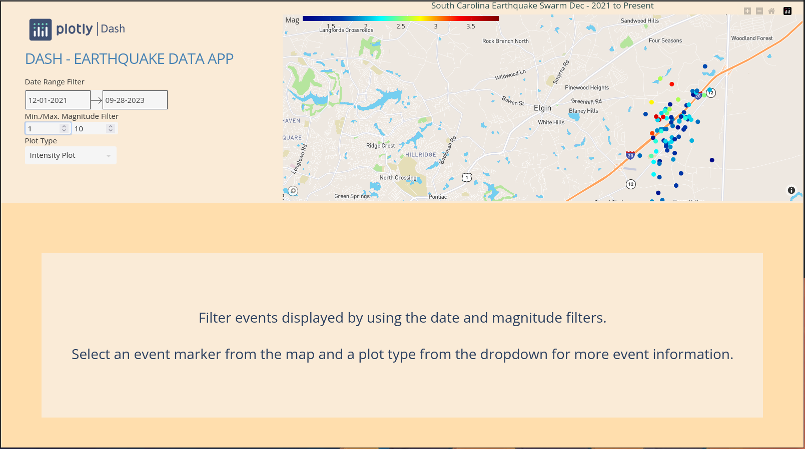

# Earthquake Data Explorer

A data visualization app for 2021 through 2022 South Carolina Earthquake Swarm.  The application will present a map where each event is plotted.  You can hover the mouse pointer over a marker to display some information about the earthquake event at that location.  By default when the app is launched, it displays the events starting on December 2021 until the current date.  You can filter the events displayed by using the date filter and/or the earthquake magnitude filter.  To display even more information about a particular event, click on the event's marker to select it, then choose a graph plot type from the dropdown.  The graph plot will be displayed below the events map.

This application was developed with Python, Dash library for creating low-code web data applications, and the Plotly library for creating the map and table visualizations.

